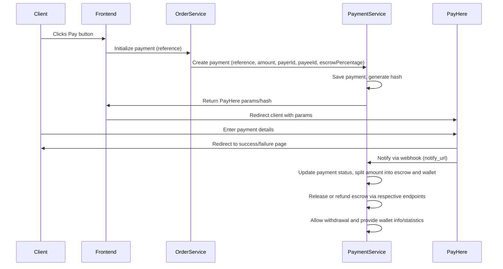

# Payment Flow and API Endpoints

This document describes the complete payment flow for purchases or services using PayHere, including both client and system perspectives, escrow logic, and all relevant API endpoints.

---

## 1. Payment Flow (Client Perspective)

1. **Client clicks the Pay button** on the frontend.
2. **Client is redirected to PayHere** payment gateway.
3. **Client enters payment details** and completes the payment.
4. **Client is redirected** to the appropriate page (success or failure) based on the payment result.

---

## 2. Payment Flow (System Perspective: Frontend + Backend)

1. **Client clicks the Pay button** on the frontend.
2. **Frontend sends a payment initialization request** to the respective service (e.g., `order-service`, `transport-service`) with the reference (orderId, transportId, etc.).
3. **The respective service calls the payment-service** with:
   - `reference` (orderId, transportId, etc.)
   - `amount`
   - `payerId` (userId of the buyer)
   - `payeeId` (userId of the seller)
   - `escrowPercentage` (if applicable)
4. **Payment-service creates the payment record** and saves it in the database.
5. **Payment-service generates the PayHere hash** and sends it to the frontend.
6. **Frontend redirects the client to PayHere** with all required parameters.
7. **Client enters payment details and completes the payment** on PayHere.
8. **Client is redirected** to the appropriate page (success or failure) based on the payment result.
9. **PayHere sends a notification** to the `notify_url` (webhook) with the payment status (success or failure).
10. **Payment-service receives the notification** and updates the payment status in the database accordingly.
    - If the payment is **successful**:
        - The escrow amount of the payee is increased by `amount * escrowPercentage`.
        - The remaining amount (`amount - (amount * escrowPercentage)`) is added directly to the payee's wallet balance.
    - If the payment is **failed/cancelled/refunded**:
        - The payment status is updated accordingly; no funds are credited.

---

## 3. API Endpoints

### Payment Initialization
- **Endpoint:** `POST /api/payment/payhere/initiate`
- **Description:** Initializes a payment, generates the hash, and returns PayHere parameters.
- **Request Body:**
  - `reference` (String): Order ID, Transport ID, etc.
  - `amount` (Decimal): Payment amount
  - `payerId` (Long): User ID of the buyer
  - `payeeId` (Long): User ID of the seller
  - `escrowPercentage` (Decimal, optional): Escrow percentage
  - Other PayHere-required fields (firstName, lastName, email, etc.)
- **Response:**
  - PayHere payment parameters including hash

### PayHere Notification Handler (Webhook)
- **Endpoint:** `POST /api/payment/payhere/notify`
- **Description:** Receives payment status notification from PayHere and updates payment status in the database. If successful, splits the amount into escrow and direct wallet credit for the payee.
- **Request Params:** As specified by PayHere (merchant_id, order_id, payment_id, payhere_amount, payhere_currency, status_code, md5sig, etc.)
- **Response:** `OK` or error message

### Release Escrow Amount
- **Endpoint:** `POST /api/payment/release-escrow`
- **Description:** Releases the escrowed amount for a transaction/order. Moves the respective escrow amount from the payee's escrow to their wallet balance.
- **Request Body:**
  - `reference` (String): Order/Transaction reference
  - `payeeId` (Long): User ID of the payee
- **Response:** Success/failure message

### Refund Escrow Amount
- **Endpoint:** `POST /api/payment/refund-escrow`
- **Description:** Refunds the escrowed amount for a transaction/order. Removes the respective escrow amount from the payee's wallet and adds it to the payer's wallet balance.
- **Request Body:**
  - `reference` (String): Order/Transaction reference
  - `payeeId` (Long): User ID of the payee
  - `payerId` (Long): User ID of the payer
- **Response:** Success/failure message

### Withdraw Wallet Amount
- **Endpoint:** `POST /api/payment/withdraw`
- **Description:** Allows a user to withdraw money from their wallet (excluding escrow amount).
- **Request Body:**
  - `userId` (Long): User ID
  - `amount` (Decimal): Amount to withdraw
  - `bankDetails` (Object): Bank account info
- **Response:** Success/failure message

### Get Wallet Info
- **Endpoint:** `GET /api/payment/wallet/{userId}`
- **Description:** Returns wallet info for a user, including balance, escrow amount, and payment history. Open to admins and moderators for any user.
- **Response:**
  - `amount` (Decimal): Wallet balance
  - `escrowAmount` (Decimal): Escrowed funds
  - `paymentHistory` (Array): List of transactions

### Get Payment Statistics (Admin/Moderator)
- **Endpoint:** `GET /api/payment/statistics`
- **Description:** Returns statistical info for admins/moderators, such as total amounts, revenue, number of transactions, etc.
- **Response:**
  - `totalAmount` (Decimal)
  - `totalRevenue` (Decimal)
  - `transactionCount` (Integer)
  - Other relevant stats

---

## 4. Escrow Logic
- When a payment is initialized, the payment record is created.
- Upon successful payment notification:
    - The escrow amount of the payee is increased by `amount * escrowPercentage`.
    - The remaining amount is credited directly to the payee's wallet balance.
- Funds can be released from escrow to the seller via the release endpoint.
- Refunds and disputes are handled by refunding the escrow amount to the payer via the refund endpoint.
- Withdrawals are allowed only from the wallet balance (not escrow).

---

## 5. Payment Status Updates
- Payment status is updated based on PayHere notification (`notify_url`).
- Status codes:
  - `2`: Success
  - `0`: Pending
  - `-1`: Cancelled
  - `-2`: Failed
  - `-3`: Refunded

---

## 6. Example Sequence Diagram

---

## 7. Notes
- All payment and escrow logic is managed by the backend (payment-service).
- PayHere is used only for collecting payments; escrow and payouts are managed internally.
- Accurate transaction records and compliance are essential.
- Sellers must provide bank details for payouts.
- Payouts are done manually or via online banking, not automated by PayHere.
